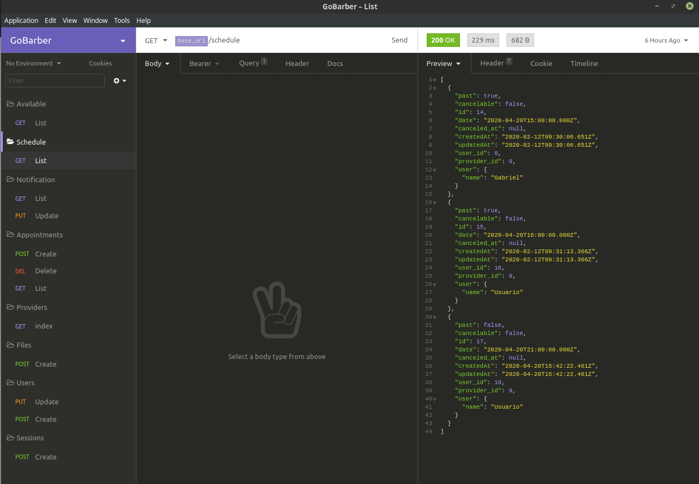
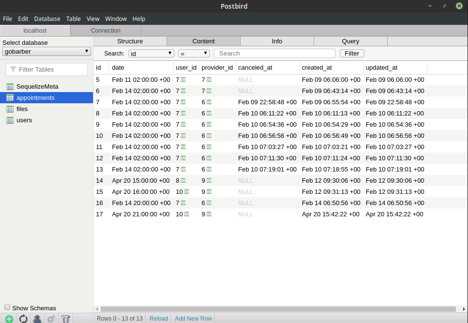
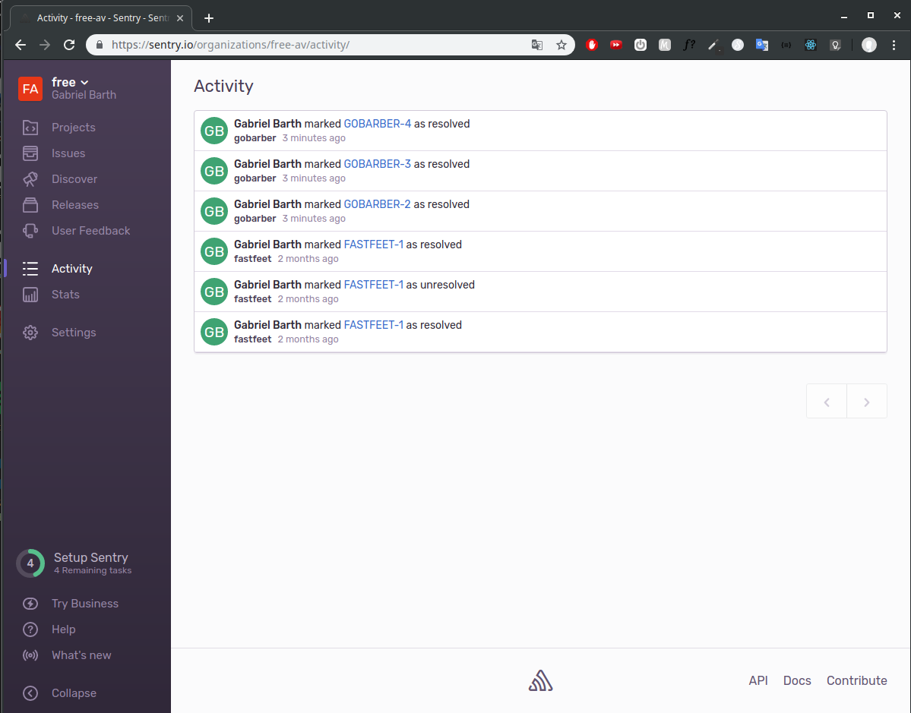
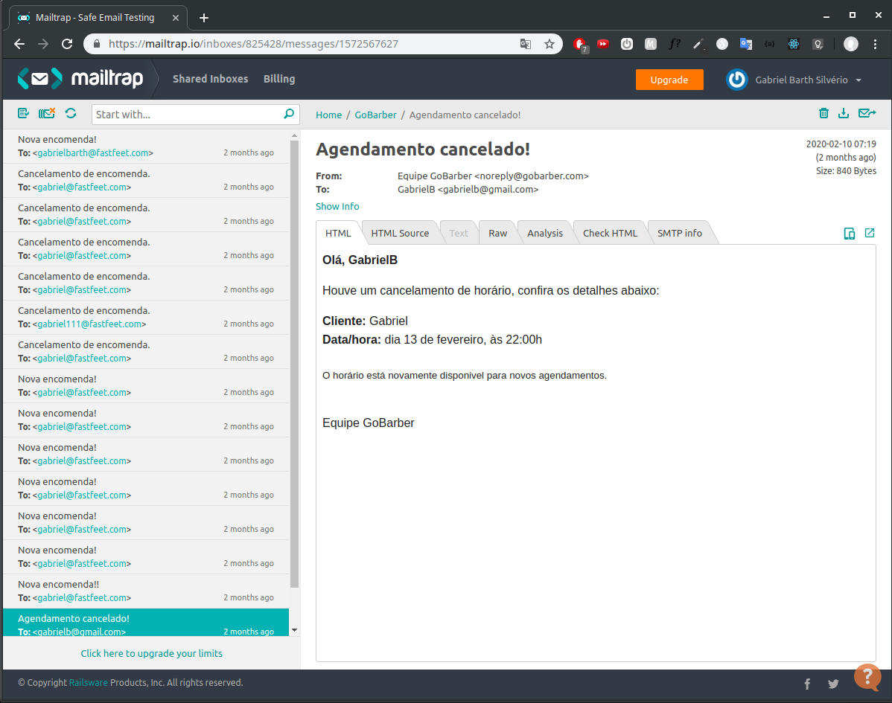

<h1 align="center">
  
 
 
GoBarber (backend)
</h1>

 
Backend (node.js) project of  barber shop scheduling app :barber:, developed during <a href="https://rocketseat.com.br/">GoStack10 bootcamp</a>.
 
 

<h3 align="center">
:computer: Web version <a href="https://github.com/gabrielbarth/web-goBarber">here</a>
 
:iphone: Mobile version <a href="https://github.com/gabrielbarth/mobile-goBarber"> (in progress) </a>
</h3>

##  :mag_right:  Overview 

This application allows:

- users authentication (barbers on web version and clients on mobile version);
- create and update users;
- create, list and removing appointments;
- notification of new appointments;
- e-mail notifications about cancelled appointments.

##  :wrench:    Some used tools

### Insomnia
Allows testing API routes.

   

### Postbird
Cross-platform PostgreSQL GUI client, written in JavaScript.

   

### Sentry
Allows gebugging Node apps and prevent crashes across your entire stack.

   

### Mailtrap
Allows inspect and debug your email samples before delivering them to your customers.

   

##  :link: Project dependencies / Bibliotecas utilizadas

:ballot_box_with_check: <a href="https://sentry.io/for/node/">**sentry/node**</a>           `// exception handling in production mode`  
:ballot_box_with_check: <a href="https://github.com/dcodeIO/bcrypt.js/">**bcryptjs**</a>            `// generate hash though user password`   
:ballot_box_with_check: <a href="https://date-fns.org/">**date-fns**</a>            `// node library to handle data`  
:ballot_box_with_check: <a href="https://github.com/bee-queue/bee-queue">**bee-queue**</a>            `// job/task queue for Node.js, backed by Redis`  
:ballot_box_with_check: <a href="https://github.com/expressjs/cors">**cors**</a>                  `// node.js package to enable CORS with various option`  
:ballot_box_with_check: <a href="https://github.com/motdotla/dotenv">**dotenv**</a>                 `// load environment variables in application paths`  
:ballot_box_with_check: <a href="https://expressjs.com/pt-br/">**express**</a>               `// basically allows create backend application`   
:ballot_box_with_check: <a href="https://mongoosejs.com/">**mongoose**</a>                `// elegant mongodb object modeling for node.js`   
:ballot_box_with_check: <a href="https://github.com/davidbanham/express-async-errors">**express-async-errors**</a>       `// allows express capture errors that happens inside async functions`  
:ballot_box_with_check: <a href="https://github.com/ericf/express-handlebars">**express-handlebars**</a>          `// allows build semantic templates`  
:ballot_box_with_check: <a href="https://github.com/auth0/node-jsonwebtoken">**jsonwebtoken**</a>             `//  allows generate jwt token for users`  
:ballot_box_with_check: <a href="https://github.com/expressjs/multer">**multer**</a>                      `//  allows file uploads in application`  
:ballot_box_with_check: <a href="https://nodemailer.com/about/">**nodemailer**</a>                 `// allow easy email sending`   
:ballot_box_with_check: <a href="https://www.npmjs.com/package/nodemailer-express-handlebars">**nodemailer-express-handlebars**</a>     `// allows build semantic templates with nodemailer`  
:ballot_box_with_check: <a href="https://nodejs.org/api/path.html">**path**</a>         `// provides utilities for working with file and directory paths`  
:ballot_box_with_check: <a href="https://node-postgres.com/">**pg**</a>            `// allows use postgrees database`  
:ballot_box_with_check: <a href="https://github.com/scarney81/pg-hstore">**pg-hstore**</a>         `// allows use postgrees database too`  
:ballot_box_with_check: <a href="https://sequelize.org/">**sequelize**</a>           `// ORM Node.js for SQL databases (postgress in this case)`  
:ballot_box_with_check: <a href="https://github.com/poppinss/youch">**youch**</a>                `// pretty error reporting for Node.js`  
:ballot_box_with_check: <a href="https://github.com/jquense/yup">**yup**</a>                 `// treat validations `  

#### Development libs / Bibliotecas de desenvolvimento utilizadas no projeto:  
:ballot_box_with_check: <a href="https://eslint.org/">**eslint**</a>         `// analyzes your code to quickly find problems`  
:ballot_box_with_check: <a href="https://github.com/remy/nodemon">**nodemon**</a>             `// allows automatically restarting app`  
:ballot_box_with_check: <a href="https://prettier.io/">**prettier**</a>              `// code formatter (as the name says)`  
:ballot_box_with_check: <a href="https://github.com/sequelize/cli">**sequellize-cli**</a>        `// sequelize client - ORM for SQL databases`  
:ballot_box_with_check: <a href="https://github.com/alangpierce/sucrase">**sucrase**</a>               `//  allows ES6 import/export modules`  

## :computer: Running on your machine 

Consider the steps below to run this API on your machine:

**First step:** You'll need three docker containers running: redis, mongo and other to postgress.

This commands can create these docker containers:

- `docker run --name redisbarber -p 6379:6379 -d -t redis:alpine`;
- `docker run --name mongobarber -p 27017:27017 -d -t mongo`;
- `docker run --name some-postgres -e POSTGRES_PASSWORD=mysecretpassword -p 5432:5432 -d postgres`;

Some tips about docker:
- `docker ps` - list all docker containers (in execution).
- `docker ps -a` - list all docker containers (in execution or not).
- `docker stop <container-name>` - stops container execution.
- `docker start <container-name>` -  starts container execution (required whenever you restart your machine).
- `docker logs <container-name>` - shows container log (used in errors case).

**Second step:** Clone this repository on your machine and do necessary configurations.

1. Clone this repo using `https://github.com/gabrielbarth/backend-goBarber.git`.
2. Move to the appropriate directory: `cd backend-goBarber`. 
3. Run `yarn` to install dependencies. 
4. Copy the `.env.example` file and rename it to just `.env`. 
5. Add all the values for the environment variables on .env file. 
6. Run `yarn start` and `yarn queue` to run the servers at `http://localhost:3000`.

### Any question?
Send an email to me: gabrielbarth98@gmail.com.

